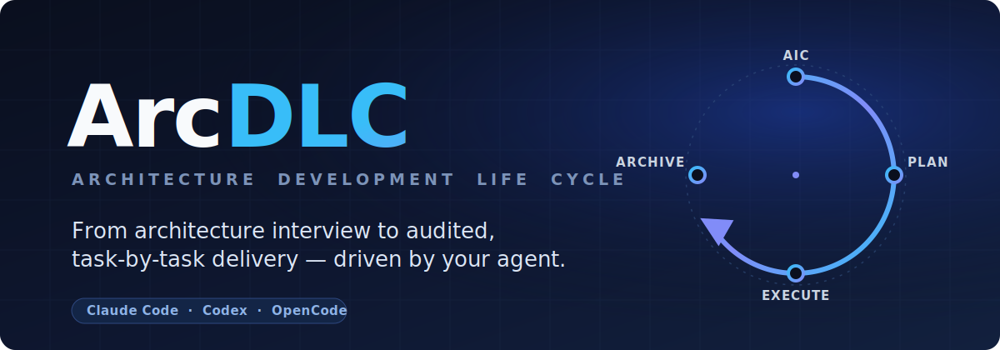

<p align="center">
  <a href="https://github.com/FrogoAI/arcdlc">
    
  </a>
</p>

<p align="center">
  <a href="https://github.com/FrogoAI/arcdlc/actions/workflows/ci.yml"></a>
  <a href="./LICENSE"></a>
  
  
</p>

<p align="center">
  <b>ArcDLC</b> — the open, agent-native <b>Architecture Development Life Cycle</b>.<br>
  Take an initiative from a grilled architecture interview to audited, task-by-task implementation.
</p>

Our philosophy:

```
→ architecture-first, not prompt-first
→ deterministic plans, not vibes
→ audited every step, not assumed done
→ brownfield audits and greenfield builds — one workflow
→ agent-native across Claude Code, Codex, and OpenCode
```

> [!TIP]
> **Two tracks, one queue.** ArcDLC builds **applications** and enforces **governance policies**
> through the same executable plan. Architecture is decomposed into `docs/aics/<slug>/plan.md`, audit
> findings are filed into it, and `/arcdlc:execute` works it off — one task, one commit, at a time.

## See it in action

```text
You: /arcdlc:aic checkout-redesign
AI:  Before I write anything, let's pin down the architecture.
     (grilled interview — boundaries, constraints, trade-offs)
     ✓ docs/aics/checkout-redesign/aic.md   — the architecture document
     ✓ docs/adr/                            — the decisions, captured as ADRs
     ✓ CONTEXT.md                           — the shared brief for every agent
     ✓ AGENTS.md / README.md                — registered in the initiative list (arctool sync)

You: /arcdlc:plan checkout-redesign
AI:  Decomposing the architecture into an executable queue...
     ✓ docs/aics/checkout-redesign/plan.md  — 12 tasks, each with testable Acceptance criteria

You: /arcdlc:execute checkout-redesign
AI:  Working docs/aics/checkout-redesign/, one commit per task...
     ✓ AIC-1  Add health endpoint         TODO → DONE
     ✓ AIC-2  Wire structured logging      TODO → DONE
     ✓ AIC-3  Enforce request timeouts     TODO → DONE
     Tests green. Lint clean.

You: /arcdlc:archive checkout-redesign
AI:  Moved 12 DONE blocks to docs/aics/checkout-redesign/plan-archive.md.
     Plan compacted. Ready for the next initiative.
```

## Why ArcDLC?

AI coding agents are fast but forgetful: architecture decisions live in chat history, plans drift,
and "done" is a vibe. ArcDLC wraps a **deterministic lifecycle** around your agent — from a grilled
architecture interview to an audited, task-by-task implementation — so complex systems get built the
way they were designed.

- **Design before you build** — a mandatory grilled interview produces the architecture document
  (AIC, arc42, TOGAF, C4, or ADRs) *before* any code is written.
- **Plans you can trust** — every task carries testable `Acceptance` criteria; the optional
  `arctool` CLI validates the contract and flips task status atomically. No hand-edited status lines.
- **Audit what already exists** — `/arcdlc:examinate` measures real code against a named architecture
  or policy (MDCA, DDD, SOLID, Twelve-Factor, …) and files each gap as a tracked task.
- **Bring your own agent** — one install-agnostic bundle for Claude Code, Codex, and OpenCode.

## Why teams adopt ArcDLC

Solo, ArcDLC keeps you and your agent honest: initiatives start from an architecture interview, not
a vague prompt, and land as audited commits. On a team, the same workflow scales to **governance** —
policies become auditable rules, and every violation becomes a task the whole team's agents work off
the shared plan queue.

- **Architecture that survives the agent** — decisions captured as documents and ADRs, not lost in a
  chat transcript.
- **Compliance as a loop, not a wiki** — audit the codebase against a design or policy; gaps become
  `TODO` plan tasks that `/arcdlc:execute` closes.
- **One queue per initiative** — features and policy fixes flow through the same
  `docs/aics/<slug>/plan.md`, driven deterministically by `arctool`.

## How we compare

**vs. unstructured AI coding** — Prompts in chat, no memory of decisions, "done" left unverified.
ArcDLC captures architecture as documents and enforces testable acceptance before anything is marked
done.

**vs. spec-only workflows** — Specs describe *what* to build. ArcDLC governs the whole *architecture
development life cycle* — decision, decomposition, execution, audit, and archival — and drives it
with a deterministic, zero-dependency CLI.

**vs. heavyweight EA tooling** (TOGAF suites, enterprise modeling) — Powerful but disconnected from
the code and the agent. ArcDLC speaks the same formats (TOGAF, arc42, C4, ADR) yet lives in your repo
and actually executes the plan.

## Quick Start

```bash
curl -fsSL https://raw.githubusercontent.com/FrogoAI/arcdlc/main/install.sh | bash
```

Installs the skills into every agent it detects (Claude Code, Codex, OpenCode) and the `arctool`
binary for linux/darwin × amd64/arm64. Then, in your project:

```
/arcdlc:aic <slug>       # grilled interview → docs/aics/<slug>/ architecture document
/arcdlc:plan <slug>      # decompose it → docs/aics/<slug>/plan.md task queue
/arcdlc:execute <slug>   # implement every task, one commit each
/arcdlc:archive <slug>   # compact the plan, preserving history
```

Each initiative gets its own folder `docs/aics/<slug>/`, and every command takes the slug as its first
argument (e.g. `/arcdlc:plan checkout`). Details and manual alternatives: [Installation](#installation).

---

## Commands

| Command | What it does | Output |
| --- | --- | --- |
| `/arcdlc:aic <slug> [aic\|arc42\|togaf\|c4\|adr]` | Build the initiative's architecture document (AIC by default). Always runs a grilled interview first. | `docs/aics/<slug>/<format>.md`, ADRs, `CONTEXT.md` |
| `/arcdlc:policy <name>` | Author a governance policy per the Policy of Policies framework — grilled interview first. | `docs/policies/<name>.md` + index |
| `/arcdlc:plan <slug>` | Decompose the approved architecture document into the executable task queue. | `docs/aics/<slug>/plan.md` |
| `/arcdlc:examinate <slug> [policy]` | Examine existing code for compliance with a named policy or design (`MDCA`, `DDD`, `SOLID`, …; default: the project's own AIC) and register gaps as plan tasks. | `docs/aics/<slug>/gap.md`, new TODO blocks in `docs/aics/<slug>/plan.md` |
| `/arcdlc:execute <slug> [TASK-ID]` | Implement all pending plan tasks (or one by ID): status `TODO→TAKEN→DONE`, tests/lint, one commit per task. | code, tests, commits |
| `/arcdlc:remove <slug>` | Delete a completed initiative's folder and clean the registry — always after an explicit confirmation. | removed folder, refreshed `docs/aics/` + registry |
| `/arcdlc:archive <slug>` | Move `DONE` task blocks into `docs/aics/<slug>/plan-archive.md`, keeping the plan small. | compacted plan + archive |
| `source-map` skill | Routing table into the bundled architecture & engineering reference library (AIC, arc42, TOGAF, C4, ADR, DDD, SOLID, MDCA, Go guides, Twelve-Factor, …). | reference guidance |

### Initiatives live in folders

Each initiative gets its own folder `docs/aics/<slug>/` (holding the architecture document, `plan.md`,
`gap.md`, and `plan-archive.md`). Every pipeline command takes the slug as its **first argument**
(e.g. `/arcdlc:execute checkout`); a command run without a slug lists the initiatives and stops,
instead of guessing. Task IDs need only be unique within one initiative's plan, and each
`/arcdlc:execute` run works exactly one initiative. `arctool sync` keeps the list below in step with
`docs/aics/`, and `/arcdlc:remove <slug>` retires a finished one.

<!-- arcdlc:initiatives:begin -->
- [Initiative Lifecycle](docs/aics/initiative-lifecycle/aic.md) — Mandatory slug-first selection, an arctool-synced initiative registry, and an always-confirmed removal flow.
<!-- arcdlc:initiatives:end -->

ArcDLC is a universal delivery tool: it builds **applications** and authors **policies**, and both
feed the same executable plan queue (`docs/aics/<slug>/plan.md`).

- **Application track:** `/arcdlc:aic <slug>` → `/arcdlc:plan <slug>` → `/arcdlc:execute <slug>` → `/arcdlc:archive <slug>`
- **Governance track:** `/arcdlc:policy <name>` → `/arcdlc:examinate <slug> docs/policies/<name>.md` → `/arcdlc:execute <slug>`

In the governance track the policy itself is just rules — nothing gets "planned". `/arcdlc:examinate`
audits the codebase against those rules and files each violation as a `TODO` task directly into
`docs/aics/<slug>/plan.md`; `/arcdlc:execute` then closes those gaps. If the audit finds nothing (or the
policy has no code impact), the track ends with the policy document.

Every plan task carries testable `Acceptance` criteria; `/arcdlc:execute` must demonstrate them
before a task may be marked `DONE`. The full contract lives in
[`skills/plan/references/plan-format.md`](skills/plan/references/plan-format.md).

## Repository Layout

```
arcdlc/
├── .claude-plugin/          # plugin.json + marketplace.json (Claude Code plugin metadata)
├── assets/                  # README banner (arcdlc_bg.svg)
├── skills/                  # one skill per directory (SKILL.md each)
│   ├── source-map/          # reference library (SKILL.md + source/)
│   ├── aic/  policy/  plan/  examinate/  execute/  archive/
│   └── plan/references/plan-format.md   # the executable-plan contract
├── cmd/arctool/               # arctool CLI entry point
├── internal/plan/           # plan parser, validator, mutator, archiver (+ tests)
├── Makefile                 # build / install / test / release
├── install.sh               # one-line installer (skills + arctool, all agents)
└── .github/workflows/       # CI (lint+test+cross-compile) and tag-driven releases
```

## Installation

### One-line install (recommended)

```bash
curl -fsSL https://raw.githubusercontent.com/FrogoAI/arcdlc/main/install.sh | bash
```

The installer:

- detects which agents you have (Claude Code, Codex, OpenCode) and installs the skills for each
  — via the official `claude plugin` CLI when available (Claude Code ≥ 2.1.157), otherwise into
  the agent's skills directory;
- installs the `arctool` binary to `~/.local/bin`: a checksum-verified release binary for
  **linux/amd64, linux/arm64, darwin/amd64, darwin/arm64**, falling back to a source build when
  Go is installed and no release binary is reachable;
- is idempotent — re-running upgrades everything in place.

Options go after `bash -s --` (or as flags to a local `./install.sh`):

```bash
... | bash -s -- --agents claude,codex   # explicit agent list (default: auto-detect)
... | bash -s -- --bindir ~/bin          # custom arctool location
... | bash -s -- --skills-only           # skip arctool
... | bash -s -- --tool-only             # skip the skills
... | bash -s -- --uninstall             # remove everything it installed
```

Piping scripts to bash requires trust — the script is short, dependency-free (`curl` + `tar`),
and worth the read: [`install.sh`](install.sh).

### Claude Code (manual)

Via the plugin marketplace — non-interactive from the shell (Claude Code ≥ 2.1.157), or with the
in-app `/plugin` equivalents:

```bash
claude plugin marketplace add FrogoAI/arcdlc
claude plugin install arcdlc@arcdlc
```

Commands appear namespaced as `/arcdlc:<name>`.

Alternative — clone into your skills directory; Claude Code auto-loads the plugin:

```bash
git clone https://github.com/FrogoAI/arcdlc ~/.claude/skills/arcdlc
```

### Codex / OpenCode (manual)

These agents have no plugin namespace, so install each sub-skill flattened as `arcdlc-<name>`
(identical behavior, invoked by skill name instead of a slash command):

```bash
git clone https://github.com/FrogoAI/arcdlc /tmp/arcdlc
skills_root=~/.codex/skills          # OpenCode: ~/.config/opencode/skills
mkdir -p "$skills_root"
for d in /tmp/arcdlc/skills/*/; do
  cp -r "$d" "$skills_root/arcdlc-$(basename "$d")"
done
```

### `arctool` CLI (optional, recommended)

`arctool` is the deterministic companion for `docs/aics/<slug>/plan.md`: it validates the plan
contract, picks the next task, and flips task status atomically so the agent never hand-edits status
lines. It resolves the initiative from `--aic <slug>` or `--plan <path>` — a selection is always
required. It is pure Go standard library — the binaries are static and need no runtime.

Every ArcDLC skill probes `command -v arctool` and falls back to manual markdown handling when it
is absent, so the CLI is always optional.

```bash
# via go install
go install github.com/FrogoAI/arcdlc/cmd/arctool@latest

# or from a release: download the binary for your platform from
# https://github.com/FrogoAI/arcdlc/releases and put it on PATH
```

## Building from Source

Requires Go ≥ 1.22.

```bash
git clone https://github.com/FrogoAI/arcdlc
cd arcdlc
make build      # local binary at bin/arctool
make install    # install into ~/.local/bin (override with BINDIR=...)
make test       # go test ./...
make release    # static cross-compiled binaries in dist/ (linux/darwin × amd64/arm64)
```

CI runs `gofmt`, `go vet`, `go test`, validates the plugin manifests and skill layout, and
cross-compiles all platforms on every push and pull request. Pushing a `v*` tag builds the
release binaries with SHA256 checksums and publishes them as a GitHub release.

## Usage Examples

### End-to-end application flow

```
/arcdlc:aic checkout      # grilled interview → docs/aics/checkout/aic.md (+ ADRs, CONTEXT.md)
/arcdlc:plan checkout     # decompose the document → docs/aics/checkout/plan.md task queue
/arcdlc:execute checkout  # implement every TODO task, one commit per task
/arcdlc:archive checkout  # move DONE blocks to docs/aics/checkout/plan-archive.md
```

The slug is always the first argument — every command names the initiative it works on. Run a single
task, audit an existing codebase, produce a different format, or retire a finished initiative:

```
/arcdlc:execute payments AIC-3       # implement only task AIC-3 in the payments initiative
/arcdlc:examinate payments MDCA      # audit code against MDCA, gaps become plan tasks
/arcdlc:aic payments arc42           # produce an arc42 doc in docs/aics/payments/
/arcdlc:remove payments              # delete the finished initiative (after confirming)
```

### Governance flow

```
/arcdlc:policy log-retention                                    # grilled interview → docs/policies/log-retention.md
/arcdlc:examinate log-retention docs/policies/log-retention.md  # audit the repo; violations land in docs/aics/log-retention/plan.md as TODO tasks
/arcdlc:execute log-retention                                   # close the gaps task by task (skip if the audit found none)
```

### Driving the plan with `arctool`

A plan task block looks like this (full contract in
[`plan-format.md`](skills/plan/references/plan-format.md)):

```md
### AIC-1 (MISSING): Add health endpoint

- WHAT: Add `GET /healthz` returning build version.
- HOW:
  Handler returns `{"version": <build version>}`; inject the version via `main.go` ldflags, no new deps.
- WHERE:
  Layer `handler`: `internal/handler/health.go`, `router.go`.
  Tests: `internal/handler/health_test.go`.
- WHY: Deploys are unverifiable without a liveness probe.
- Acceptance:
  - GIVEN a running server WHEN `GET /healthz` THEN the response is 200 with the build version.
- References: `docs/aics/checkout/aic.md`.
- Status: TODO.
```

Every `arctool` command requires an explicit selection: `--aic <slug>` to target an initiative, or
`--plan <path>` for a file (with neither, `arctool` lists the initiatives and exits 2):

```bash
arctool validate --strict      # enforce the contract (unique IDs, statuses, Acceptance per task)
arctool list                   # all tasks + status counts
arctool next --json            # first TODO block as JSON (exit 3 when queue is empty)
arctool take AIC-1             # claim it: TODO → TAKEN (refuses non-TODO without --force)
arctool done AIC-1 --aic checkout   # complete it in a named initiative: TAKEN → DONE
arctool block AIC-1 -m "vendor API returns 500 on staging"
arctool archive --dry-run      # preview which DONE blocks would move to plan-archive.md
arctool archive                # move them (archive written first — crash-safe)
```

All mutations are guarded, byte-preserving, atomic rewrites of the single status line —
`arctool` never reformats your plan.

## License

[MIT](LICENSE) — © FrogoAI.
