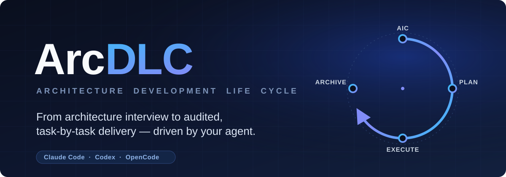

<p align="center">
  <a href="https://github.com/FrogoAI/arcdlc">
    
  </a>
</p>

<p align="center">
  <a href="https://github.com/FrogoAI/arcdlc/actions/workflows/ci.yml"></a>
  <a href="./LICENSE"></a>
  
  
</p>

<p align="center">
  <b>ArcDLC</b> — the open, agent-native <b>Architecture Development Life Cycle</b>.<br>
  Take an initiative from a grilled architecture interview to audited, task-by-task implementation.
</p>

Our philosophy:

```
→ architecture-first, not prompt-first
→ deterministic plans, not vibes
→ audited every step, not assumed done
→ brownfield audits and greenfield builds — one workflow
→ agent-native across Claude Code, Codex, OpenCode, Cursor, and Antigravity
```

> [!TIP]
> **Two tracks, one queue.** ArcDLC builds **applications** and enforces **governance policies**
> through the same executable plan. Architecture is decomposed into `docs/aics/<slug>/plan.md`, audit
> findings are filed into it, and `/arcdlc:execute` works it off — one task, one commit, at a time.

## See it in action

```text
You: /arcdlc:aic checkout-redesign
AI:  Before I write anything, let's pin down the architecture.
     (grilled interview — boundaries, constraints, trade-offs)
     ✓ docs/aics/checkout-redesign/aic.md   — the architecture document
     ✓ docs/adr/                            — the decisions, captured as ADRs
     ✓ CONTEXT.md                           — the shared brief for every agent
     ✓ AGENTS.md / README.md                — registered in the initiative list (arctool sync)

You: /arcdlc:plan checkout-redesign
AI:  Decomposing the architecture into an executable queue...
     ✓ docs/aics/checkout-redesign/plan.md  — 12 tasks, each with testable Acceptance criteria

You: /arcdlc:execute checkout-redesign
AI:  Working docs/aics/checkout-redesign/, one commit per task...
     ✓ AIC-1  Add health endpoint         TODO → DONE
     ✓ AIC-2  Wire structured logging      TODO → DONE
     ✓ AIC-3  Enforce request timeouts     TODO → DONE
     Tests green. Lint clean.

You: /arcdlc:archive checkout-redesign
AI:  Moved 12 DONE blocks to docs/aics/checkout-redesign/plan-archive.md.
     Plan compacted. Ready for the next initiative.
```

## Why ArcDLC?

AI coding agents are fast but forgetful: architecture decisions live in chat history, plans drift,
and "done" is a vibe. ArcDLC wraps a **deterministic lifecycle** around your agent — from a grilled
architecture interview to an audited, task-by-task implementation — so complex systems get built the
way they were designed.

- **Design before you build** — a mandatory grilled interview — one question at a time, each with a
  recommended answer — produces the architecture document (AIC, arc42, Tech Stack Canvas, TOGAF, C4,
  or ADRs) in plain English, *before* any code is written.
- **Plans you can trust** — every task carries testable `Acceptance` criteria; the optional
  `arctool` CLI validates the contract and flips task status atomically. No hand-edited status lines.
- **Audit what already exists** — `/arcdlc:examinate` measures real code against a named architecture
  or policy (MDCA, DDD, SOLID, Twelve-Factor, …) and files each gap as a tracked task.
- **Documents that read like a person wrote them** — every skill carries the same
  `Talk simple, write like a human` rule: plain English, no AI filler, no long dashes, concrete facts,
  and the domain's own terms kept and defined once. Plain words never mean less content.
- **An agent that asks instead of guessing** — every skill also carries `Judge by the four virtues`:
  wisdom (ask, do not guess), courage (say the hard thing), justice (write the answer down where the
  next session reads it), temperance (touch only what you were pointed at).
- **Bring your own agent** — one install-agnostic bundle. The skills are plain Markdown with no
  agent-specific syntax, so they install for Claude Code, Codex, OpenCode, Cursor and Antigravity.
  See [what is actually tested](#agent-support) before you rely on one.

## Why teams adopt ArcDLC

Solo, ArcDLC keeps you and your agent honest: initiatives start from an architecture interview, not
a vague prompt, and land as audited commits. On a team, the same workflow scales to **governance** —
policies become auditable rules, and every violation becomes a task the whole team's agents work off
the shared plan queue.

- **Architecture that survives the agent** — decisions captured as documents and ADRs, not lost in a
  chat transcript.
- **Compliance as a loop, not a wiki** — audit the codebase against a design or policy; gaps become
  `TODO` plan tasks that `/arcdlc:execute` closes.
- **One queue per initiative** — features and policy fixes flow through the same
  `docs/aics/<slug>/plan.md`, driven deterministically by `arctool`.

## How we compare

**vs. unstructured AI coding** — Prompts in chat, no memory of decisions, "done" left unverified.
ArcDLC captures architecture as documents and enforces testable acceptance before anything is marked
done.

**vs. spec-only workflows** — Specs describe *what* to build. ArcDLC governs the whole *architecture
development life cycle* — decision, decomposition, execution, audit, and archival — and drives it
with a deterministic, zero-dependency CLI.

**vs. heavyweight EA tooling** (TOGAF suites, enterprise modeling) — Powerful but disconnected from
the code and the agent. ArcDLC speaks the same formats (TOGAF, arc42, C4, ADR) yet lives in your repo
and actually executes the plan.

## Quick Start

```bash
curl -fsSL https://raw.githubusercontent.com/FrogoAI/arcdlc/main/install.sh | bash
```

Installs the skills into every agent it detects (Claude Code, Codex, OpenCode, Cursor, Antigravity) and the `arctool`
binary for linux/darwin × amd64/arm64. Then, in your project:

```
/arcdlc:init            # detect one repo or a workspace, scaffold what the skills need
/arcdlc:aic <slug>       # grilled interview → docs/aics/<slug>/ architecture document
/arcdlc:plan <slug>      # decompose it → docs/aics/<slug>/plan.md task queue
/arcdlc:plan-human <slug> # board stories → docs/aics/<slug>/plan-human.md
/arcdlc:assist <slug>    # sweep // ARCDLC markers → docs/aics/<slug>/comments.md + plan tasks
/arcdlc:execute <slug>   # implement every task, one commit each
/arcdlc:archive <slug>   # compact the plan, preserving history
```

Each initiative gets its own folder `docs/aics/<slug>/`, and every command takes the slug as its first
argument (e.g. `/arcdlc:plan checkout`). Details and manual alternatives: [Installation](#installation).

---

## Commands

| Command | What it does | Output |
| --- | --- | --- |
| `/arcdlc:init [--migrate]` | Detect the layout, grill, and scaffold. In a workspace, clone or create the `docs` hub, link the root, and migrate on request. | the six files, or the hub plus four root links |
| `/arcdlc:aic <slug> [aic\|arc42\|tsc\|togaf\|c4\|adr]` | Build the initiative's architecture document (AIC by default). Always runs a grilled interview first. Formats combine: `arc42,tsc` writes both from one interview; `arc42:html` emits HTML. | `docs/aics/<slug>/<format>.md`, ADRs, `CONTEXT.md` |
| `/arcdlc:policy <name>` | Author a governance policy per the Policy of Policies framework — grilled interview first. | `docs/policies/<name>.md` + index |
| `/arcdlc:plan <slug>` | Decompose the approved architecture document into the executable task queue. | `docs/aics/<slug>/plan.md` |
| `/arcdlc:plan-human <slug>` | Turn the task queue into the engineer stories a board shows: one story per service, numbered instructions, technical acceptance criteria, each self-contained so a ticket needs no file from this repository. | `docs/aics/<slug>/plan-human.md` + mapping in `CONTEXT.md` |
| `/arcdlc:examinate <slug> [policy]` | Examine existing code for compliance with a named policy or design (`MDCA`, `DDD`, `SOLID`, …; default: the project's own AIC) and register gaps as plan tasks. | `docs/aics/<slug>/gap.md`, new TODO blocks in `docs/aics/<slug>/plan.md` |
| `/arcdlc:assist <slug> [MARKER]` | Turn code comment markers into planned work: `arctool scan` sweeps the source for `// ARCDLC ...` (or `TODO`, `FIXME`, `HACK`, `XXX`, `BUG` when asked) and records each one, markers sharing a tag (`// ARCDLC:T1 ...`) become one record, the skill grills the engineer about the unclear ones, and every marker that names real work becomes a plan task. | `docs/aics/<slug>/comments.md`, new TODO blocks in `docs/aics/<slug>/plan.md`, the marker comments removed from the code once the engineer says so |
| `/arcdlc:execute <slug> [TASK-ID]` | Implement all pending plan tasks (or one by ID): status `TODO→TAKEN→DONE`, tests/lint, one Conventional Commits commit per task. Problems seen outside a task are filed as blocked findings at the end of the plan and reviewed with you at the end of the run. | code, tests, commits |
| `/arcdlc:remove <slug>` | Delete a design folder for good, after an explicit confirmation that warns references to it may be left pointing at nothing. | removed folder, refreshed `docs/aics/` + registry |
| `/arcdlc:archive <slug>` | Move `DONE` task blocks into `docs/aics/<slug>/plan-archive.md`, keeping the plan small. | compacted plan + archive |
| `/arcdlc:close <slug>` | Close a finished initiative in place: a `CLOSED.md` note with the outcome, the plan files deleted, no new work after. | `docs/aics/<slug>/CLOSED.md`, refreshed registry |
| `/arcdlc:grilling [topic]` | The interview every other command falls back to when something is unclear, contradictory, risky, or needs a human, usable on its own: relentless questions, **one at a time**, each with a recommended answer, until nothing is silently assumed. | settled decisions, `CONTEXT.md` terms, ADRs |

Each skill carries the templates and rule sets it needs in its own `references/` folder: the
architecture templates with `/arcdlc:aic`, the audit standards (MDCA, DDD, SOLID, the Go guides) with
`/arcdlc:examinate`, the policy framework with `/arcdlc:policy`.

### Initiatives live in folders

Each initiative gets its own folder `docs/aics/<slug>/` (holding the architecture document, `plan.md`,
`gap.md`, `comments.md`, `plan-human.md`, and `plan-archive.md`). Every pipeline command takes the slug as its **first argument**
(e.g. `/arcdlc:execute checkout`); a command run without a slug lists the initiatives and stops,
instead of guessing. Task IDs need only be unique within one initiative's plan, and each
`/arcdlc:execute` run works exactly one initiative. `arctool sync` keeps the list below in step with
`docs/aics/`, and `/arcdlc:close <slug>` closes a finished one in place; `arctool status` lists every
initiative with its phase.

<!-- arcdlc:initiatives:begin -->
_none_

3 closed initiatives: run `arctool status`, or see `CLOSED.md` in each folder.
<!-- arcdlc:initiatives:end -->

ArcDLC is a universal delivery tool: it builds **applications** and authors **policies**, and both
feed the same executable plan queue (`docs/aics/<slug>/plan.md`).

- **Application track:** `/arcdlc:aic <slug>` → `/arcdlc:plan <slug>` → `/arcdlc:execute <slug>` → `/arcdlc:archive <slug>`
- **Governance track:** `/arcdlc:policy <name>` → `/arcdlc:examinate <slug> docs/policies/<name>.md` → `/arcdlc:execute <slug>`

In the governance track the policy itself is just rules — nothing gets "planned". `/arcdlc:examinate`
audits the codebase against those rules and files each violation as a `TODO` task directly into
`docs/aics/<slug>/plan.md`; `/arcdlc:execute` then closes those gaps. If the audit finds nothing (or the
policy has no code impact), the track ends with the policy document.

Every plan task carries testable `Acceptance` criteria; `/arcdlc:execute` must demonstrate them
before a task may be marked `DONE`. The full contract lives in
[`skills/plan/references/plan-format.md`](skills/plan/references/plan-format.md).

### One repository or a workspace

`/arcdlc:init` detects which of two layouts it stands in. Single repository is the default and
unchanged: `docs/aics/<slug>/`, `AGENTS.md`, `README.md`, and `CONTEXT.md` sit in that one repository,
exactly as every example above shows them.

A workspace is several repositories checked out side by side under a root that is not itself a git
repository. Initiatives, ADRs, and the glossary live in one hub instead: a git repository cloned as
`docs/` directly under that root, and `docs` is the only name it may have (see
[ADR-0026](docs/adr/0026-a-workspace-keeps-its-docs-in-a-sibling-repository-named-docs.md)). Four
symlinks at the root, `AGENTS.md`, `CLAUDE.md`, `README.md`, and `CONTEXT.md`, each point at the file
of the same name in the hub; `make -C docs init` creates them on a new machine, and every agent and
every `arctool` call runs from the root. The hub lives on its default branch only, and every write to
it is followed by a commit and a push.

A workspace task carries a `- Repo: <name>` key naming the one repository its `WHERE` files live in
(`docs` for a task that touches only the hub), and its `WHERE` paths are relative to the workspace
root, not to that repository. `/arcdlc:execute` makes two commits per task: one in the hub for the
status change, one in the named repository for the code. The hub is pushed after each of its commits;
the product repository is never pushed by a run. `arctool sync` runs from the workspace root, the same
as every other command.

```text
root/
├── AGENTS.md -> docs/AGENTS.md
├── CLAUDE.md -> docs/CLAUDE.md
├── README.md -> docs/README.md
├── CONTEXT.md -> docs/CONTEXT.md
├── docs/               # the hub, a git repository
│   ├── aics/
│   └── adr/
├── fdb-server/         # a product repository
└── fdb-client/         # a product repository
```

## Agent support

The bundle is install-agnostic by construction: every `SKILL.md` is plain Markdown with no
agent-specific syntax, and the installer flattens the same files for each target. That is what makes
five agents possible. It is not the same as five agents being tested.

| Agent | Install | Status |
|---|---|---|
| Claude Code | plugin (`/arcdlc:<name>`) or `~/.claude/skills/` | **Used daily.** This is where the bundle is developed and exercised. |
| Codex, OpenCode, Cursor | flat skills, `arcdlc-<name>` | Install path covered by CI on every push. Skill behaviour not routinely exercised. |
| Antigravity | `agy` plugin, else flat skills | Only the flat fallback is covered by CI, because CI cannot run `agy`. The plugin path has never been confirmed against a shipping build. |

CI proves the files land in the right directories, the installer is idempotent, uninstall is clean,
and a retired skill is swept. It cannot prove a skill behaves correctly on an agent, because that
means running a real agent.

So: if you use ArcDLC somewhere other than Claude Code and something misbehaves, that is worth an
issue rather than a surprise. Nothing here is known broken; most of it is simply unverified.

## Repository Layout

```
arcdlc/
├── .claude-plugin/          # plugin.json + marketplace.json (Claude Code plugin metadata)
├── .antigravity-plugin/     # the Antigravity plugin manifest
├── assets/                  # README banner (arcdlc_bg.svg)
├── skills/                  # twelve skills, one per directory (SKILL.md each)
│   ├── grilling/            # the one-question-at-a-time interview every skill runs on
│   │   └── references/      # Writing Style.md, the shared writing standard
│   ├── init/references/     # Scaffold Templates.md, the repository and workspace scaffold templates
│   ├── aic/references/      # AIC, arc42, TSC, TOGAF, C4, ADR templates + diagram conventions
│   ├── examinate/references/# MDCA, DDD, SOLID, ECS, the Go guides: the audit rule sets
│   ├── policy/references/   # the Policy of Policies framework
│   ├── plan/references/     # plan-format.md, the executable-plan contract
│   ├── plan-human/references/  # story-format.md, the board-story contract
│   └── policy/  execute/  assist/  remove/  archive/  close/
├── docs/
│   ├── adr/                 # architecture decision records (README.md indexes them)
│   ├── aics/<slug>/         # one folder per initiative: arch doc, plan, gap, comments
│   └── comment-markers.md   # every comment style the sweep reads (pinned by a test)
├── cmd/arctool/             # arctool CLI entry point
├── internal/plan/           # plan parser, validator, mutator, archiver (+ tests)
├── internal/registry/       # initiative registry sync (+ tests)
├── internal/scan/           # code comment sweep + comment register (+ tests)
├── CONTEXT.md               # the project's ubiquitous language
├── Makefile                 # build / install / test / release
├── install.sh               # one-line installer (skills + arctool, all agents)
└── .github/workflows/       # CI (lint+test+cross-compile) and tag-driven releases
```

## Installation

### One-line install (recommended)

```bash
curl -fsSL https://raw.githubusercontent.com/FrogoAI/arcdlc/main/install.sh | bash
```

The installer:

- detects which agents you have (Claude Code, Codex, OpenCode, Cursor, Antigravity) and installs the skills for each
  — via the official `claude plugin` CLI when available (Claude Code ≥ 2.1.157), otherwise into
  the agent's skills directory;
- installs the `arctool` binary to `~/.local/bin`: a checksum-verified release binary for
  **linux/amd64, linux/arm64, darwin/amd64, darwin/arm64**, falling back to a source build when
  Go is installed and no release binary is reachable;
- is idempotent — re-running upgrades everything in place.

Options go after `bash -s --` (or as flags to a local `./install.sh`):

```bash
... | bash -s -- --agents claude,codex   # explicit agent list (default: auto-detect)
... | bash -s -- --bindir ~/bin          # custom arctool location
... | bash -s -- --skills-only           # skip arctool
... | bash -s -- --tool-only             # skip the skills
... | bash -s -- --uninstall             # remove everything it installed
```

Piping scripts to bash requires trust — the script is short, dependency-free (`curl` + `tar`),
and worth the read: [`install.sh`](install.sh).

**Pinning a version.** `--ref vX.Y.Z` installs the skills *and* `arctool` from that release, so the two
stay on the same plan-format contract. Without it you get the latest skills from `main` and the latest
released `arctool`, and the installer warns if those two disagree. Pin when a team shares one `plan.md`.

### Claude Code (manual)

Via the plugin marketplace — non-interactive from the shell (Claude Code ≥ 2.1.157), or with the
in-app `/plugin` equivalents:

```bash
claude plugin marketplace add FrogoAI/arcdlc
claude plugin install arcdlc@arcdlc
```

Commands appear namespaced as `/arcdlc:<name>`.

Alternative — clone into your skills directory; Claude Code auto-loads the plugin:

```bash
git clone https://github.com/FrogoAI/arcdlc ~/.claude/skills/arcdlc
```

### Codex / OpenCode / Cursor / Antigravity (manual)

These agents have no plugin namespace, so install each sub-skill flattened as `arcdlc-<name>`
(identical behavior, invoked by skill name instead of a slash command):

```bash
git clone https://github.com/FrogoAI/arcdlc /tmp/arcdlc
skills_root=~/.codex/skills          # OpenCode: ~/.config/opencode/skills — Cursor: ~/.cursor/skills
mkdir -p "$skills_root"
for d in /tmp/arcdlc/skills/*/; do
  cp -r "$d" "$skills_root/arcdlc-$(basename "$d")"
done
```

On Cursor the one-line installer auto-detects the presence of `~/.cursor` and installs the same
`arcdlc-<name>` skills into `~/.cursor/skills/`. Cursor auto-discovers them and, having no
`disable-model-invocation` field, may invoke them from their descriptions in addition to explicit
use — the descriptions already name their triggers.

On Antigravity the installer prefers the native plugin, falling back to flat skills. When the `agy`
CLI is present it runs `agy plugin install <repo-or-path>` (installing into
`~/.gemini/antigravity-cli/plugins/`); otherwise it copies the same `arcdlc-<name>` skills flat,
using `skills_root=~/.gemini/config/skills` in the loop above. To install manually, either run
`agy plugin install FrogoAI/arcdlc` (or a local checkout path), or set that `skills_root` and reuse
the copy loop.

### `arctool` CLI (optional, recommended)

`arctool` is the deterministic companion for `docs/aics/<slug>/plan.md`: it validates the plan
contract, picks the next task, flips task status atomically so the agent never hand-edits status
lines, and appends a checked task block (`arctool add`). It also sweeps the source for code comment
markers (`arctool scan`) and writes the comment register `/arcdlc:assist` works from, which keeps
that sweep out of the agent's context. It resolves the initiative from `--aic <slug>` or
`--plan <path>` — a selection is always required. It is pure Go standard library — the binaries are
static and need no runtime.

Every ArcDLC skill probes `command -v arctool` and falls back to manual markdown handling when it
is absent, so the CLI is always optional.

```bash
# via go install
go install github.com/FrogoAI/arcdlc/cmd/arctool@latest

# or from a release: download the binary for your platform from
# https://github.com/FrogoAI/arcdlc/releases and put it on PATH
```

## Building from Source

Requires Go ≥ 1.22.

```bash
git clone https://github.com/FrogoAI/arcdlc
cd arcdlc
make build      # local binary at bin/arctool
make install    # install into ~/.local/bin (override with BINDIR=...)
make test       # go test ./...
make release    # static cross-compiled binaries in dist/ (linux/darwin × amd64/arm64)
```

CI runs `gofmt`, `go vet`, `go test`, validates the plugin manifests and skill layout, and
cross-compiles all platforms on every push and pull request. Pushing a `v*` tag builds the
release binaries with SHA256 checksums and publishes them as a GitHub release.

## Usage Examples

### End-to-end application flow

```
/arcdlc:aic checkout      # grilled interview → docs/aics/checkout/aic.md (+ ADRs, CONTEXT.md)
/arcdlc:plan checkout     # decompose the document → docs/aics/checkout/plan.md task queue
/arcdlc:execute checkout  # implement every TODO task, one commit per task
/arcdlc:archive checkout  # move DONE blocks to docs/aics/checkout/plan-archive.md
```

The slug is always the first argument — every command names the initiative it works on. Run a single
task, audit an existing codebase, produce a different format, or retire a finished initiative:

```
/arcdlc:execute payments AIC-3       # implement only task AIC-3 in the payments initiative
/arcdlc:examinate payments MDCA      # audit code against MDCA, gaps become plan tasks
/arcdlc:aic payments arc42           # produce an arc42 doc in docs/aics/payments/
/arcdlc:aic payments arc42,tsc       # arc42 + Tech Stack Canvas, from one interview
/arcdlc:aic payments arc42:html      # the arc42 doc as HTML instead of Markdown
/arcdlc:close payments              # close the finished initiative, keep its design
/arcdlc:remove payments              # delete the initiative for good (after confirming)
```

### Comment debt flow

A `// TODO` in the code is work nobody planned. Turn the markers a team already wrote into tasks:

```
# in the code:
#   // TODO We should move this function into a separate package, and use another
#   // naming. The function must be publicly available.

/arcdlc:assist payments          # sweep for ARCDLC, then one question at a time about the unclear ones
/arcdlc:assist payments FIXME    # the same for another marker
/arcdlc:execute payments         # implement the tasks
```

The sweep takes each marker comment out of the code once its block is in the register, so the register
is the one place the text lives and nobody plans the same comment twice. Review that change like any
other, with `git diff`.

`arctool scan` does the sweeping, so a repository with forty markers costs the agent a forty-line
summary instead of forty file reads:

```
arctool scan --aic payments                    # write docs/aics/payments/comments.md, code untouched
arctool scan --aic payments --marker TODO      # sweep a marker the team already used
arctool scan --aic payments --strip            # also delete the comments it just registered
arctool scan --aic payments --dry-run          # look first: writes nothing, edits nothing
arctool scan --aic payments --json             # the new findings as data
arctool scan --aic review                     # a slug with no folder yet: the folder is created
```

Each block in the register keeps the evidence (a `- Marker:` line per marker, with the file, line and
comment text) and the judgement (`- Verdict:` = `ACTIONABLE`, `UNCLEAR`, `STALE` or `DEFERRED`, written
by the skill; the sweep leaves it empty). Only the actionable ones become plan tasks.

**One change written down in several places is one task.** Tag the markers that belong together and the
sweep merges them into one block, named after the tag:

```go
// ARCDLC:T1 move the rebuild into internal
```
```python
# ARCDLC:t1 change the return format to the single one
```

Both land in `ARCDLC-CMT-T1`, with one `- Marker:` line each, both locations under `WHERE`, and their
words seeded into `WHAT`. Tags ignore case and belong to one marker word, so `TODO:T1` is a different
group. An untagged `// ARCDLC` stays a task of its own.

Three rules are worth knowing before the first sweep:

- **The marker is `ARCDLC`, not `TODO`.** A sweep never picks up notes your repository already had.
  `--marker TODO` (or `/arcdlc:assist <slug> TODO`) opts those in.
- **Only single-line comments carry markers.** `// ARCDLC ...` counts, `/* ARCDLC ... */` does not, in
  every language, so a language whose only comment is a block comment carries none. A marker inside a
  string or a constant is text, and the sweep steps over it.
- **The sweep does not touch your code.** It records and stops. `arctool scan --strip` deletes the
  registered comment lines, and `/arcdlc:assist` runs it only after asking and being told yes.

A re-run appends what is new and leaves existing blocks alone, except that a marker whose tag is already
registered is added to that block. A judgement already written there stands. Every comment style the
sweep reads is listed in [docs/comment-markers.md](docs/comment-markers.md).

### Governance flow

```
/arcdlc:policy log-retention                                    # grilled interview → docs/policies/log-retention.md
/arcdlc:examinate log-retention docs/policies/log-retention.md  # audit the repo; violations land in docs/aics/log-retention/plan.md as TODO tasks
/arcdlc:execute log-retention                                   # close the gaps task by task (skip if the audit found none)
```

### Driving the plan with `arctool`

A plan task block looks like this (full contract in
[`plan-format.md`](skills/plan/references/plan-format.md)):

```md
### AIC-1 (MISSING): Add health endpoint

- WHAT: Add `GET /healthz` returning build version.
- HOW:
  Handler returns `{"version": <build version>}`; inject the version via `main.go` ldflags, no new deps.
- WHERE:
  Layer `handler`: `internal/handler/health.go`, `router.go`.
  Tests: `internal/handler/health_test.go`.
- WHY: Deploys are unverifiable without a liveness probe.
- Acceptance:
  - GIVEN a running server WHEN `GET /healthz` THEN the response is 200 with the build version.
- References: `docs/aics/checkout/aic.md`.
- Status: TODO.
```

One optional line, `- Executor: opus, high effort.` or `- Executor: sonnet`, pins the tier for that
one task above the `Executor tier:` pin in `CONTEXT.md`. `/arcdlc:plan` writes it only when you ask
for it, and `arctool next --json` returns it as `executor`.

Every `arctool` command requires an explicit selection: `--aic <slug>` to target an initiative, or
`--plan <path>` for a file (with neither, `arctool` lists the initiatives and exits 2):

```bash
arctool validate --strict      # enforce the contract (unique IDs, statuses, Acceptance per task)
arctool list                   # all tasks + status counts
arctool next --json            # first TODO block as JSON (exit 3 when queue is empty)
arctool take AIC-1             # claim it: TODO → TAKEN (refuses non-TODO without --force)
arctool done AIC-1 --aic checkout   # complete it in a named initiative: TAKEN → DONE
arctool block AIC-1 -m "vendor API returns 500 on staging"
arctool order AIC-3 AIC-1 AIC-2   # re-order task blocks (slot permutation; unnamed tasks never move)
arctool order AIC-3 AIC-1 --dry-run   # preview the new order without writing
arctool archive --dry-run      # preview which DONE blocks would move to plan-archive.md
arctool archive                # move them (archive written first — crash-safe)
arctool scan                   # sweep ARCDLC markers into comments.md, code untouched (3 if none)
arctool scan --strip           # also delete the comments it just registered
arctool scan --dry-run         # what it would record, writing nothing
```

Status changes rewrite only the one `- Status:` line and leave every other byte alone. `archive`
and `order` rewrite the whole file, and both re-parse their own output before they write it. `scan`
only appends blocks to the register and deletes the comment lines it just recorded, and it verifies
every file it touched before writing a byte. Every write is atomic. `arctool` never reformats your plan beyond the block spacing those two commands
normalise.

## License

[MIT](LICENSE) — © FrogoAI.
