# Diagram Conventions

**Purpose**: The single home for how initiative diagrams are produced, named, and colored. Applies to every notation in this library: C4, UML, BPMN, flowcharts, and the diagrams embedded in an arc42 document.

This file holds the shared rules plus the DOT templates for UML, BPMN, and flowcharts. C4 keeps its own templates in `C4.md` and ArchiMate keeps its own in `TOGAF.md`, because both are also `/arcdlc:aic` output formats.

---

## File Convention

All diagrams live in the `images/` folder inside the initiative directory, in **dual format**: the DOT source is committed next to the compiled image, so a diagram is always editable rather than redrawn.

1. Write DOT source: `images/<name>.dot`
2. Compile: `dot -Tpng images/<name>.dot -o images/<name>.png`
3. Embed in docs: ``

**Naming**: lowercase, underscores, descriptive, prefixed by notation.

| Notation | DOT source | Embed form | Examples |
|----------|------------|------------|----------|
| C4 | `images/c4_<level>_<name>.dot` | `` | `c4_context`, `c4_container`, `c4_component_list_manager`, `c4_dynamic_upload`, `c4_deployment_prod`, `c4_landscape` |
| UML | `images/<type>_<name>.dot` | `` | `component_lists`, `sequence_upload`, `state_list_sync`, `deployment_k8s`, `usecase_lists`, `class_domain`, `activity_cbf_rebuild` |
| BPMN | `images/bpmn_<process_name>.dot` | `` | `bpmn_order_intake`, `bpmn_list_approval` |
| Flowchart | `images/flow_<name>.dot` | `` | `flow_request_validation`, `flow_cbf_rebuild`, `flow_list_entry_routing`, `flow_migration_procedure`, `flow_error_handling` |
| ArchiMate (TOGAF) | `images/archimate_<layer>.dot` | `` | `archimate_business`, `archimate_application` |

- C4 `<level>`: `context`, `container`, `component`, `code`, `dynamic`, `deployment`, `landscape`.
- UML `<type>`: the diagram type — `component`, `sequence`, `state`, `deployment`, `usecase`, `class`, `activity`.

**Tooling**:

- **Primary**: Graphviz DOT, for every notation in this library.
- **Fallback**: Markdown ASCII for simple sequence flows — inline in the document, no image file needed.

---

## Color Palettes

Two palettes are in use and they are **not interchangeable**. Choose by the **notation of the diagram, not by the document it appears in**: a C4 diagram keeps the C4 palette even inside a flowchart-heavy document, and a UML, BPMN, or flowchart diagram keeps the shared pastel palette even inside a C4-heavy document. Never mix the two inside one diagram.

### C4 diagrams — blue element family

**Applies to C4 diagrams only** (context, container, component, code, dynamic, deployment, landscape). Color encodes the *role* of the element.

| Element | Hex | Usage |
|---------|-----|-------|
| Person | `#08427B` | Dark blue, white text |
| Your System / Container | `#1168BD` / `#438DD5` | Blue family, white text |
| New Container | `#2694AB` | Teal, white text — highlights new additions |
| Component | `#85BBF0` | Light blue, black text |
| External System | `#999999` | Grey, white text |
| Deprecated | `#FFB5B5` | Red-tinted, black text |
| Infrastructure Node | `#C9E7B7` | Green (matches ArchiMate Technology layer) |
| System Boundary | `#1168BD` border | Dashed cluster outline |

### UML, BPMN, and flowchart diagrams — shared pastel palette

**Applies to UML UML, BPMN, and flowchart diagrams.** Color encodes the *kind of step*.

| Element | Color | Hex | Usage |
|---------|-------|-----|-------|
| Start / Success | Pale green | `#C9E7B7` | Entry points, successful outcomes |
| Process step | Pale cyan | `#B5FFFF` | Normal processing steps |
| Decision | Pale yellow | `#FFFFB5` | Decision diamonds, gateways |
| Error / End (failure) | Pale red | `#FFB5B5` | Error states, failure exits |
| Data store | Pale cyan | `#B5FFFF` | Database, file storage |
| Annotation | White | `#FFFFFF` | Comments, notes |

### Reading the overlap

- Two hexes appear in both palettes with different meanings: `#C9E7B7` (C4: infrastructure node — shared: start/success) and `#FFB5B5` (C4: deprecated — shared: error/failure). Interpret them in the palette of the diagram's notation.
- One deliberate crossover: UML use-case diagrams color external actors with the C4 person and external-system hexes (`#08427B`, `#999999`) so actors read the same across notations — see the use case template below.
- ArchiMate diagrams use a third, layer-based palette that stays with its notation in `TOGAF.md` (`## ArchiMate Diagram Conventions`).

---

## Choosing a notation

Draw a diagram only when it shows something the reader cannot get from the text. Then pick by what you
need to show:

| You need to show | Draw |
|---|---|
| High-level services or modules | C4 container or component (`C4.md`) |
| Infrastructure and deployment | C4 deployment, or a UML deployment diagram |
| Domain types and their relationships | class diagram |
| How components interact in one scenario | sequence diagram (ASCII inline is fine) |
| A workflow with decisions or parallel paths | activity diagram, or BPMN when roles matter |
| An entity's lifecycle | state machine |
| What actors can do | use case diagram |
| A business process with roles, events, and handoffs | BPMN |
| A procedure, an algorithm, or error handling | flowchart |
| Enterprise layers | ArchiMate (`TOGAF.md`) |

BPMN over an activity diagram when the process crosses roles or waits on external events; activity
diagram when it is one system's internal logic.

---

## UML templates

Component, activity, state machine, use case, and class. Sequence diagrams are usually clearer as inline ASCII than as DOT.

### Component Diagram

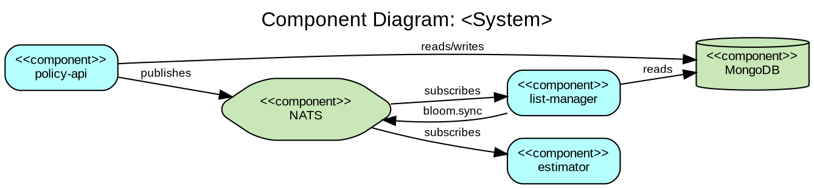

### Activity Diagram

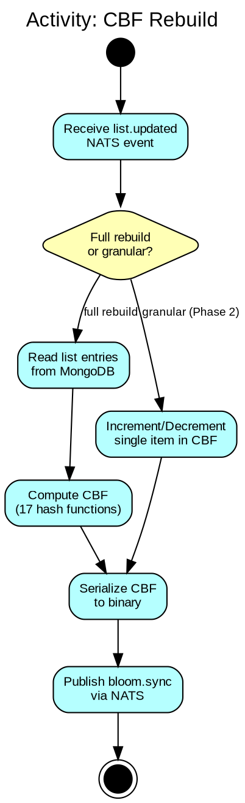

### State Machine Diagram

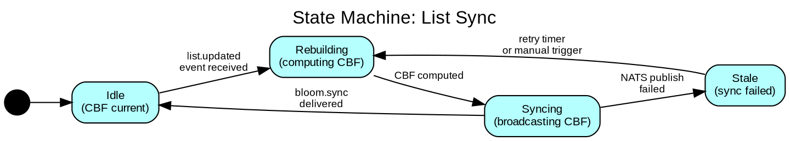

### Use Case Diagram

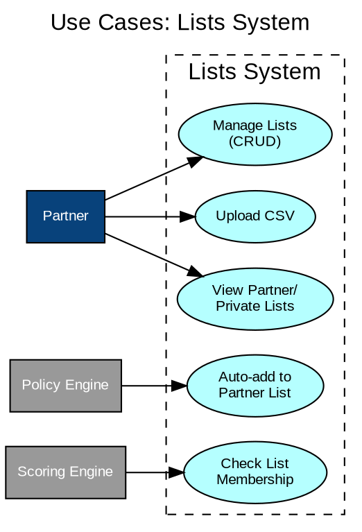

### Class Diagram (Go Adaptation)

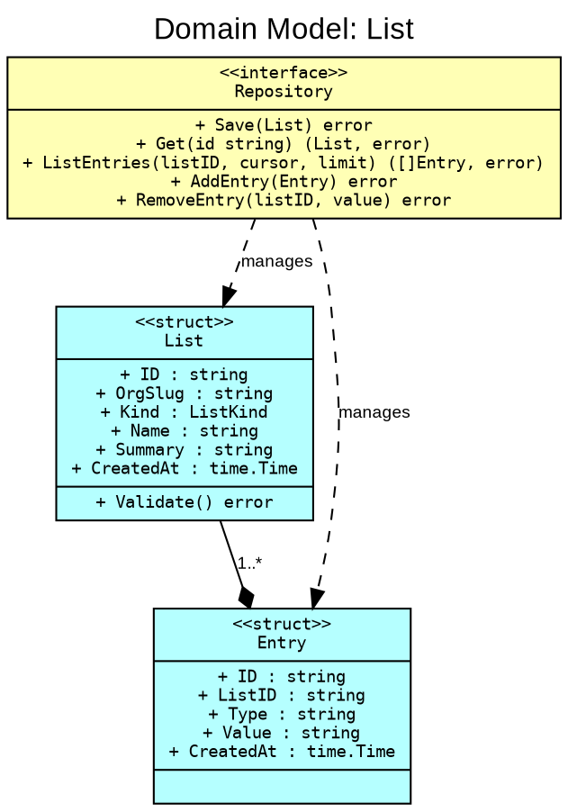

---

## BPMN templates

Exclusive gateway (XOR, exactly one path), parallel gateway (AND, all paths), inclusive gateway (OR, one or more), event-based gateway (whichever event fires first). Swimlanes carry the roles.

### Process with Exclusive Gateway

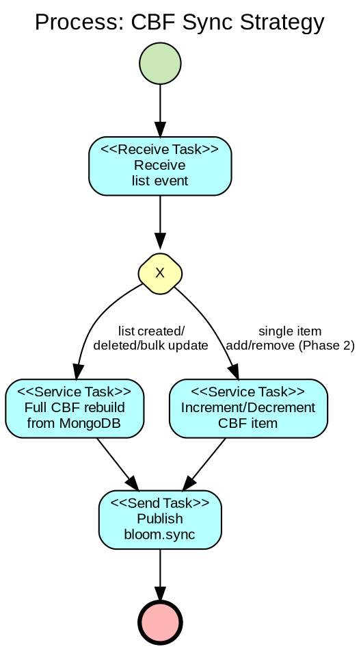

### Process with Parallel Gateway and Swimlanes

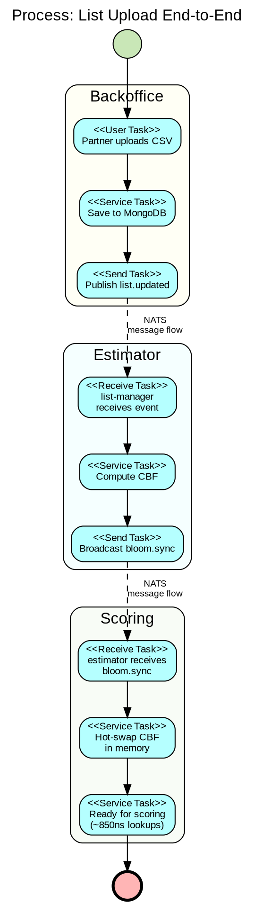

---

## Flowchart templates

ISO 5807 shapes: oval terminator, rectangle process, diamond decision, parallelogram input/output, cylinder data store.

### Simple Linear Flow

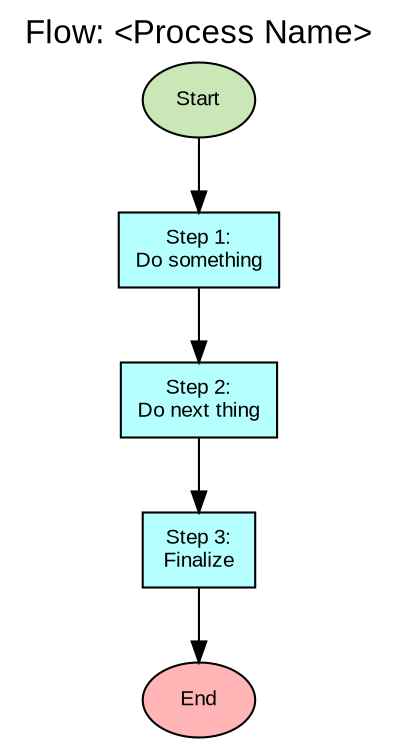

### Decision Flow

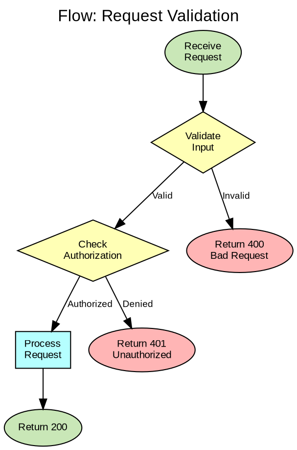

### Loop Flow

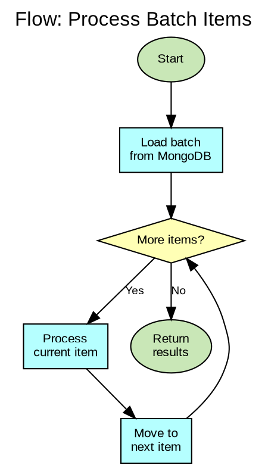

### Multi-Way Decision

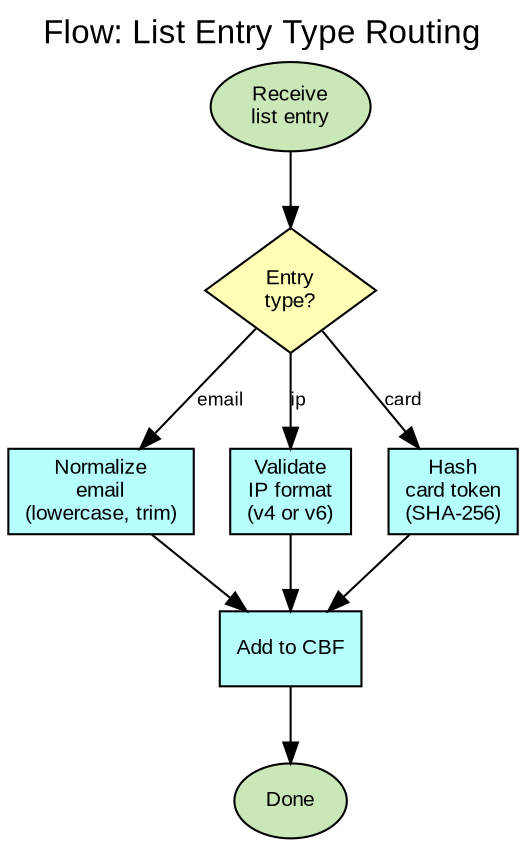

### Error Handling Flow (Go Pattern)

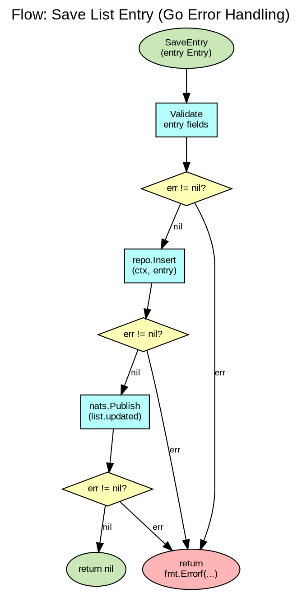

### Parallel / Fork-Join Flow

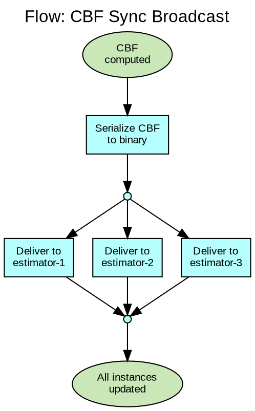
